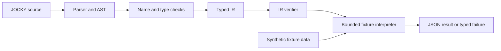

# JOCKY

**A typed programming framework for authorised computer and network forensics.**

Write investigation logic in a dedicated language, validate it before execution,
and work toward consistent forensic results across operating systems.

**Status:** Version 3 complete · **Next:** Portable Linux collectors · **Scope:** Authorised lab research

[Quick start](#quick-start) · [How it works](#how-it-works) · [Testing](#testing) · [Roadmap](#roadmap) · [Documentation](#documentation)

---

## Overview

JOCKY is a university cybersecurity project exploring how a purpose-built language
can make forensic workflows easier to describe, validate and reproduce. Its
architecture separates the compiler, platform-specific collection, endpoint runtime
and operator interface through typed contracts.

The current implementation includes a working language frontend, semantic checker,
verified intermediate representation (IR), and a bounded interpreter that runs
against prepared sample data. A FastAPI service and React dashboard provide the
initial health/status interface.

> **Current boundary:** JOCKY does not yet collect real evidence, execute tasks on
> endpoints or generate native investigation packages. Fixture execution runs real
> program logic against synthetic data; it is not live threat detection.

Development is **Linux first**, with planned coverage for documented Debian-based,
Red Hat-family and Arch-based configurations. Windows operational support comes
later. This roadmap is not a claim that collectors already work on those systems.

## What works today

| Area                     | Available in Version 3                                                                                            |
| ------------------------ | ----------------------------------------------------------------------------------------------------------------- |
| Language                 | Modules, targets, typed functions, bindings, calls, conditions, bounded loops, returns and generic types          |
| Static analysis          | Name resolution, argument/return type checks, platform restrictions, unused-binding and unreachable-code warnings |
| Diagnostics              | Source-located errors with filenames, lines, columns and deterministic human/JSON output                          |
| Compiler infrastructure  | Typed JSON IR, stable instruction IDs, deterministic builds and independent verification                          |
| Reference interpreter    | Fixture-only execution with instruction, collection, work, storage and call-depth limits                          |
| Module contracts         | Discovery of ten planned forensic functions; real implementations explicitly marked unavailable                   |
| Shared contracts         | JSON Schemas for endpoint identity, tasks, status events, forensic records, evidence and build manifests          |
| Controller and dashboard | Health/version API and a React status page; no investigation management yet                                       |

The language currently recognises `windows` and `ubuntu` as target names.
A generic `linux` target is planned for the next milestone through a versioned
compatibility change.

## A JOCKY program

The bundled [triage example](examples/triage.jky) describes a small investigation:

```text
module triage

target windows | ubuntu

fn investigate(target: endpoint) -> forensic_result {
    let system = forensic.system.profile(target)
    let processes = forensic.process.list(target)
    let connections = forensic.network.connections(target)
    let indicators = forensic.indicator.correlate(system, processes, connections)
    return forensic_result(system, indicators)
}

run investigate on selected_endpoints
```

Today this program can be parsed, type-checked, lowered to IR and executed against
a supplied fixture. The function names describe contracts, not currently available
native collectors. See the [language reference](docs/language-reference.md).

## How it works

The implemented compiler and fixture path is:



The parser preserves source locations. Semantic analysis checks program meaning
against versioned module contracts. Lowering produces a typed execution plan, and
the verifier rejects invalid plans before the interpreter can run them.

The interpreter receives only supplied fixture data. It does not inspect the host,
spawn processes, access the network or request elevated privileges. The CLI reads
only its explicit source/artifact/fixture inputs and writes requested output.

The controller/dashboard health path is currently separate from this compiler
workflow. The planned operational path adds native packages, authorised endpoint
execution, read-only collectors and results displayed in the dashboard.

### Technology stack

| Layer              | Technologies                                                 | Current role                                                 |
| ------------------ | ------------------------------------------------------------ | ------------------------------------------------------------ |
| Language and IR    | Rust, Pest, Serde / serde_json                               | Implemented compiler and fixture engine                      |
| Controller         | Python 3.12, FastAPI, Pydantic                               | Health/version service                                       |
| Management storage | PostgreSQL, Redis, SQLAlchemy, Alembic                       | Development services and future persistence/queue boundaries |
| Dashboard          | React, TypeScript, Vite                                      | Controller status interface                                  |
| Quality checks     | Cargo, Pytest, Vitest, React Testing Library, GitHub Actions | Local tests and configured CI                                |

## Requirements

The commands below use Bash on Linux. Install these prerequisites before setup:

| Tool               | Requirement                                                                                        |
| ------------------ | -------------------------------------------------------------------------------------------------- |
| Git                | Clone and manage the repository                                                                    |
| Rust               | Current stable toolchain, Cargo, Rustfmt and Clippy                                                |
| Native build tools | A C compiler/linker and standard development tools for Rust dependencies                           |
| Python             | **3.12**, including `venv` and pip; the controller requires `>=3.12,<3.13`                         |
| Node.js and npm    | Use **Node 22.20+ on the 22.x line** for the dashboard; locally tested with 22.22.2                |
| Docker Compose     | Optional for the CLI and offline tests; needed for the development service stack and Compose check |

The recorded local environment uses Fedora Linux, Rust 1.98.1, Python 3.12.13 and
Node 22.22.2. This is development verification, not live collector certification.

> **Rust compatibility:** The existing `rust-version = "1.85"` declaration does
> not match some locked dependencies. Use current stable; the declared minimum
> remains unverified. Do not downgrade dependencies merely to follow that value.

Check your tools:

```bash
git --version
rustc --version
cargo --version
python3.12 --version
node --version
npm --version
rustup component add rustfmt clippy
```

The last command assumes Rust was installed through rustup. With a distribution
toolchain, install its matching Rustfmt/Clippy packages instead. Package names and
available versions vary across Linux distributions.

## Quick start

The CLI demonstration needs Rust and Python 3.12 for repository preparation.
It does **not** need the controller, dashboard, Docker or an endpoint VM.

### 1. Clone and build

```bash
git clone https://github.com/0Ankitexe/JOCKEY.git
cd JOCKEY

cargo fetch --locked
python3.12 ci/prepare_legacy_ast_schema.py
cargo build --workspace --locked --offline
```

The preparation utility copies the bundled legacy AST schema to the fixed location
used by preserved parser tests. It runs without downloads and prints `prepared`
or `unchanged`. It refuses to overwrite a conflicting file.

Dependency installation requires network access unless already cached. Subsequent
Rust checks use `--locked --offline`.

### 2. Check the example

Run from the repository root:

```bash
target/debug/jockyc parse examples/triage.jky
target/debug/jockyc check examples/triage.jky
```

Parsing prints `parsed: examples/triage.jky`. A clean semantic check is silent and
exits with status `0`. Neither command executes forensic functions.

### 3. Run synthetic triage

```bash
target/debug/jockyc run-fixture examples/triage.jky --fixture examples/fixtures/triage/ubuntu
```

The command prints a JSON report. Look for:

- `mode: "fixture"`
- `outcome.status: "success"`
- A `forensic_result` containing the synthetic hostname `fixture-ubuntu`
- The indicator message `Authored fixture match; not live detection.`

The supplied example executes 10 IR instructions. Its timestamps, host details
and indicator data come from the fixture, not your computer.

The Windows-labelled fixture also runs on the same Linux development host:

```bash
target/debug/jockyc run-fixture examples/triage.jky --fixture examples/fixtures/triage/windows
```

This checks platform-labelled sample data; it is not Windows native execution.

## CLI reference

All examples assume the workspace has been built and you are at the repository root.

| Command                                               | Purpose                                             |
| ----------------------------------------------------- | --------------------------------------------------- |
| `jockyc parse <file>`                                 | Validate syntax                                     |
| `jockyc parse <file> --emit-ast json`                 | Print the source-located AST                        |
| `jockyc check <file>`                                 | Validate syntax, names, types and declared metadata |
| `jockyc check <file> --diagnostic-format human\|json` | Select diagnostic/report format                     |
| `jockyc modules list`                                 | List planned module contracts                       |
| `jockyc modules describe <qualified-name>`            | Inspect a function contract                         |
| `jockyc build-ir <file> --output <new.json>`          | Lower and verify a JSON IR artifact                 |
| `jockyc verify-ir <file.json>`                        | Independently verify an artifact                    |
| `jockyc run-fixture <file> --fixture <directory>`     | Run verified IR against sample data                 |

Use `target/debug/jockyc` for the local binary; it is not installed globally by
`cargo build`. Alternatively, prefix a command with
`cargo run --quiet --locked --offline -p jocky-language --bin jockyc --`.

### Inspect and verify a program

```bash
target/debug/jockyc check examples/triage.jky --diagnostic-format json
target/debug/jockyc modules describe forensic.process.list

JOCKY_DEMO_DIR=$(mktemp -d ./target/jocky-demo.XXXXXX)
target/debug/jockyc build-ir examples/triage.jky --output "$JOCKY_DEMO_DIR/triage.ir.json"
target/debug/jockyc verify-ir "$JOCKY_DEMO_DIR/triage.ir.json"
python3.12 -m json.tool "$JOCKY_DEMO_DIR/triage.ir.json"
```

Build and verification succeed silently. The IR is an inspectable execution plan,
not a native executable. Publication refuses existing output files; create a fresh
directory for each demonstration.

### Try an intentional failure

```bash
target/debug/jockyc check language/tests/fixtures/semantic/invalid/non-bool-condition.jky
```

Expected: a source-located `condition-not-bool` diagnostic and exit status `1`.
The test program uses a non-boolean condition. This is a successful demonstration
of error detection, not a broken installation.

Generally, exit `0` means success, `1` means a rejected program/artifact or ordinary
execution failure, and `2` means setup, unavailable-version, resource or I/O failure.
Warnings do not make otherwise valid programs fail. See the
[diagnostic reference](docs/diagnostics.md) for command-specific details.

## Controller and dashboard

These optional components currently display service health only. They do not
submit investigations or display fixture reports.

### Install development dependencies

From the repository root:

```bash
python3.12 -m venv controller/.venv
controller/.venv/bin/python -m pip install -e "./controller[dev]"
(cd dashboard && npm ci)
```

### Start the controller

In one terminal, from the repository root:

```bash
(cd controller && .venv/bin/python -m uvicorn jocky_controller.main:app --reload --host 127.0.0.1 --port 8000)
```

In another terminal:

```bash
curl --fail http://127.0.0.1:8000/health
curl --fail http://127.0.0.1:8000/version
```

The health response is `{"status":"ok"}`. The version response identifies the
controller component; its package version is separate from the Version 3 product
milestone. Only `GET /health` and `GET /version` are exposed; API documentation
routes are disabled in this stage.

### Start the dashboard

In a separate terminal, from the repository root:

```bash
(cd dashboard && npm run dev -- --host localhost --port 5173 --strictPort)
```

Open **http://localhost:5173**. The page displays controller health and version.
Press `Ctrl+C` in each server terminal to stop it.

### Configuration

Defaults work for the local health demonstration. Customise through environment
variables or the documented local example files:

| Setting                                       | Purpose                                                                                 |
| --------------------------------------------- | --------------------------------------------------------------------------------------- |
| `JOCKY_ENVIRONMENT`                           | Controller environment; default `development`                                           |
| `JOCKY_ALLOWED_ORIGINS`                       | Comma-separated explicit browser origins; default `http://localhost:5173`               |
| `JOCKY_DATABASE_URL`, `JOCKY_REDIS_URL`       | Future controller persistence/queue connections; not contacted by current health routes |
| `VITE_CONTROLLER_URL`                         | Dashboard API address; default `http://localhost:8000`                                  |
| `POSTGRES_*`, `REDIS_PORT`, `CONTROLLER_PORT` | Compose database settings and published development ports                               |

See [controller/.env.example](controller/.env.example),
[dashboard/.env.example](dashboard/.env.example) and [.env.example](.env.example).
The controller reads its local `.env` when launched from `controller/`.
Restart the dashboard after changing its environment.
Never put credentials in `VITE_*` variables; they are visible to the browser.

### Optional Docker Compose services

The current Compose file includes **PostgreSQL, Redis and the controller**.
Run the dashboard separately. The health-only controller does not yet use the
database or queue for investigation management.

Validate configuration without starting containers:

```bash
docker compose --env-file .env.example config --quiet
```

For a local service stack, copy `.env.example` to `.env` **only if `.env` does
not already exist**, then replace the placeholder database password. Do not
commit `.env` or use these development settings on a public interface.

```bash
docker compose --env-file .env up --build
```

Use this instead of the manual controller to avoid a port conflict. Compose
publishes service ports on loopback. Stop the stack from another terminal with
`docker compose --env-file .env down`; named database volumes are retained.
Configuration validation does not prove containers have started successfully.

## Testing

Tests use synthetic fixtures and in-process HTTP clients. They do not contact lab
endpoints. Install development dependencies first; offline tests do not mean
dependency downloads are unnecessary.

### Rust workspace

From the repository root:

```bash
python3.12 ci/prepare_legacy_ast_schema.py
cargo fmt --all --check
cargo clippy --workspace --all-targets --locked --offline -- -D warnings
cargo test --workspace --locked --offline
```

### Python controller

From the repository root:

```bash
(
  set -e
  cd controller
  .venv/bin/python -m ruff format --check .
  .venv/bin/python -m ruff check .
  .venv/bin/python -m mypy
  .venv/bin/python -m pytest
)
```

### Dashboard

From the repository root:

```bash
(
  set -e
  cd dashboard
  npm run format:check
  npm run lint
  npm run typecheck
  npm test
  npm run build
)
```

### Repository preparation utility

```bash
controller/.venv/bin/python -m ruff format --check --config controller/pyproject.toml ci/prepare_legacy_ast_schema.py tests/test_prepare_legacy_ast_schema.py
controller/.venv/bin/python -m ruff check --config controller/pyproject.toml ci/prepare_legacy_ast_schema.py tests/test_prepare_legacy_ast_schema.py
controller/.venv/bin/python -m mypy --strict --explicit-package-bases ci/prepare_legacy_ast_schema.py tests/test_prepare_legacy_ast_schema.py
controller/.venv/bin/python -m pytest tests/test_prepare_legacy_ast_schema.py
```

### What the tests prove

| Suite               | What is checked                                                                                               |
| ------------------- | ------------------------------------------------------------------------------------------------------------- |
| Parser and checker  | Valid programs, syntax/type errors, source spans, name resolution, target restrictions and stable diagnostics |
| IR and interpreter  | Lowering, malformed-artifact rejection, repeatable fixture results, error propagation and resource limits     |
| File boundaries     | Unsafe paths, links, special files, overwrite refusal and read/write failures                                 |
| Shared contracts    | Valid/invalid JSON fixtures, required identifiers, closed enums and timestamp rules                           |
| Controller          | Configuration, typed responses/errors, CORS and health/version routes using an in-process client              |
| Dashboard           | Loading, successful responses, unavailable services, invalid responses and cancellation                       |
| Preparation utility | Exact schema copying, idempotence, conflict refusal and failure handling                                      |

Recorded local verification for the completed Version 3 baseline:

| Component     | Result                                                         |
| ------------- | -------------------------------------------------------------- |
| Rust          | 342 unit/integration tests and 5 compile-fail doctests passed  |
| Python        | 52 controller tests and 11 preparation-utility tests passed    |
| Dashboard     | 18 tests and production build passed                           |
| Quality gates | Rust/Python/TypeScript formatting, lint and type checks passed |
| Compose       | Configuration validated; no live deployment claim              |

See the [release evidence](docs/version-3-verification.md) and
[CI guide](ci/README.md). Windows/Ubuntu GitHub Actions jobs are configured; these
local results do not establish that hosted jobs have passed. Fixture tests verify
program behavior, not real-world evidence collection or detection accuracy.

## Repository layout

| Area                                       | Responsibility                                              |
| ------------------------------------------ | ----------------------------------------------------------- |
| `language/`                                | Grammar, AST, semantic analysis, lowering and `jockyc`      |
| `ir/`                                      | Typed IR, verifier and safe fixture interpreter             |
| `forensic-lib/`                            | Versioned module contracts; real collectors are future work |
| `shared/`                                  | Shared Rust vocabulary and authoritative JSON Schemas       |
| `controller/`                              | FastAPI service and Python tests                            |
| `dashboard/`                               | React status page and frontend tests                        |
| `examples/`, `fixtures/`                   | Source examples, synthetic data and schema cases            |
| `codegen/`, `runtime/`                     | Future native packages and endpoint execution               |
| `native/`                                  | Future Linux and Windows adapter boundaries                 |
| `transforms/`, `transport/`, `kernel-lab/` | Future research/transport and restricted lab boundaries     |
| `ci/`, `tests/`, `.github/workflows/`      | Setup utilities, regression tests and CI definitions        |
| `docs/`                                    | Architecture, contracts, verification and roadmap           |

## Roadmap

| Milestone      | Status / intended outcome                                                                        |
| -------------- | ------------------------------------------------------------------------------------------------ |
| Versions 0–3   | Complete: foundation, language, semantic analysis, IR and fixture execution                      |
| Version 4      | Deferred Windows collectors; retained for Version 16                                             |
| Version 5      | Next: portable Linux read-only collectors and an independently verified lab JSON report          |
| Version 6      | Linux-native function packages                                                                   |
| Versions 7–10  | Linux agents, controller tasking, dashboard and multi-endpoint results                           |
| Versions 11–14 | Protected results, safe transformation research, trusted transport and controlled lab interfaces |
| Version 15     | Integrated Linux demonstration and evaluation                                                    |
| Version 16     | Windows collectors, packages, runtime and mixed-platform integration                             |

The initial Linux collector plan targets documented x86_64/glibc VM configurations
across Debian/Ubuntu, Fedora/a named RHEL-compatible distribution, and Arch Linux.
Support must be established per distribution, release and facility—not assumed
for every Linux installation. See the [Linux-first roadmap](docs/linux-first-roadmap.md).

## Troubleshooting

| Problem                                 | What to check                                                                                                            |
| --------------------------------------- | ------------------------------------------------------------------------------------------------------------------------ |
| Missing Rust dependency in offline mode | Run `cargo fetch --locked` with network access once, then retry offline                                                  |
| Rust 1.85 fails to build                | Use current stable; the declared minimum/dependency mismatch is unresolved                                               |
| Missing legacy AST schema               | Run `python3.12 ci/prepare_legacy_ast_schema.py`; inspect conflicts instead of overwriting                               |
| Python version rejected                 | Create the controller environment with Python **3.12**, not another minor version                                        |
| Dashboard dependency engine error       | Check Node against the documented requirement, then rerun `npm ci`                                                       |
| Controller unavailable in the dashboard | Check `/health`, the API URL and the exact allowed browser origin                                                        |
| Dashboard port already in use           | Stop the conflicting server or deliberately configure another port and matching CORS origin                              |
| IR output already exists                | Create a fresh output directory; publication intentionally refuses overwrite                                             |
| Artifact/fixture path rejected          | Use ordinary files in a user-controlled local directory; avoid `..`, symlinks, special files and unsupported filesystems |
| Module is marked unavailable            | Expected: module contracts currently describe planned functions, not live collectors                                     |

## Documentation

- [Architecture and component boundaries](docs/architecture.md)
- [Language reference](docs/language-reference.md)
- [Diagnostics and CLI failures](docs/diagnostics.md)
- [Module contracts](docs/module-contracts.md)
- [Platforms and capabilities](docs/platform-capabilities.md)
- [IR specification](docs/ir-specification.md)
- [Reference interpreter](docs/reference-interpreter.md)
- [Current state](docs/current-state.md)
- [Requirement traceability](docs/traceability.md)
- [Security boundary](docs/security-boundary.md)

## Contributing

Keep changes scoped, preserve existing contracts and include unit, integration and
negative tests for new behavior. Run the relevant quality gates before submitting
a change. For bug reports, include the command, tool versions, expected behavior
and a minimal **synthetic** reproduction.

Do not upload real evidence, credentials, private endpoint details or secrets to
issues, fixtures or logs. Discuss platform/contract changes before implementing them.

## Security and limitations

JOCKY is an authorised-lab research prototype, not a production incident-response
platform. Current limitations include no live collection, native packages, endpoint
registration, task distribution or investigation dashboard.

The project excludes operational security-control bypasses, process injection,
privilege-escalation exploits, covert persistence, kernel tampering and destructive
actions. Future collectors must be read-only, bounded and explicitly authorised.
Running on Linux does not automatically designate a workstation as a lab endpoint.

Use synthetic data for the current demonstration. Keep development services local,
and never test future endpoint features against systems outside the approved lab.
